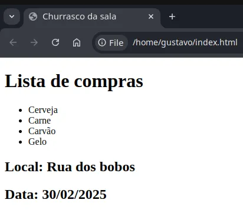
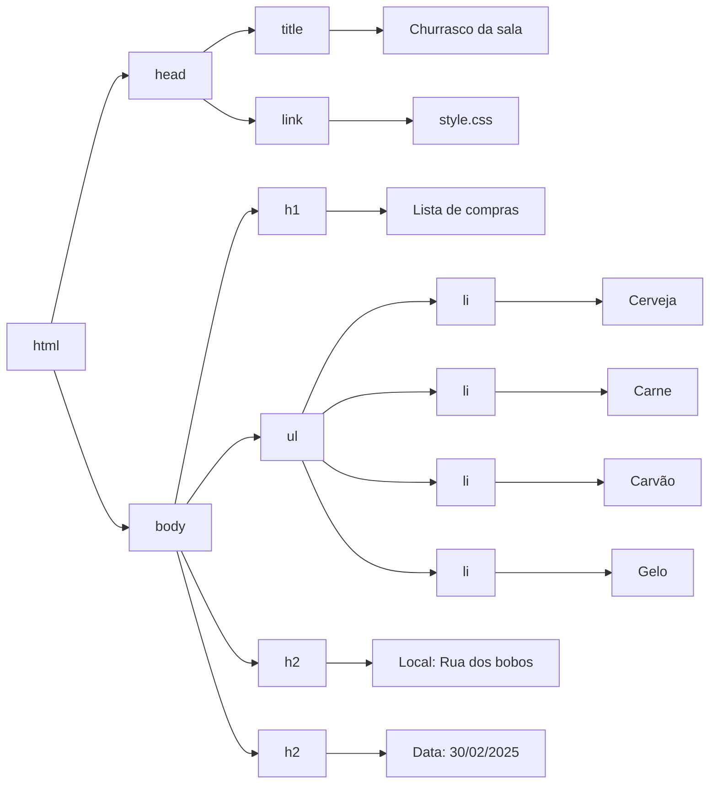

# DOM

## Sumário

1. [Definição](#definição)
2. [Função e Importância](#função-e-importância)
3. [Funcionamento](#funcionamento)
4. [Aplicações Práticas](#aplicações-práticas)
5. [Importância para o Desenvolvimento Web](#importância-para-o-desenvolvimento-web)
6. [Referências](#referências)
## Definição
DOM, do inglês Document Object Model, ou seja Modelo de Objeto de Documento é uma API cujo papel é representar e permitir interação com documentos HTML ou XML

> [!IMPORTANT]
> API (Application Programming Interface ou, em português, interface de programação de aplicações) é um conjunto de ferramentas expostas por um software para permiter que outros softwares se comuniquem com ele, sem que seja necessário conhecer os detalhes de sua implementação.
## Função e Importância
O DOM atua como uma camada intermediária, composta por um conjunto de objetos e métodos, que facilita a interação entre o código JavaScript e os elementos HTML/CSS que compõem o documento exibido no navegador. Suas principais funções incluem:
1. Assegurar a interatividade nos documentos web
2. Permitir a manipulação dinâmica de elementos HTML e CSS
3. Possibilitar a inclusão, exclusão e modificação de elementos na página
## Funcionamento
Os navegadores utilizam o DOM para representar o documento carregado como uma estrutura de árvore, onde:
- Cada nó representa um ou mais elementos do documento
- O código em execução no navegador pode acessar e interagir com cada nó
- É possível criar, remover ou modificar nós
- Eventos que ocorrem na página podem ser "escutados" e tratados
O diagrama abaixo apresenta a estrutura de árvore que representa o documento HTML da imagem abaixo, onde cada nó da árvore representa uma tag HTML ou um conjunto de tags HTML e as folhas representam os conteúdos das tags:

## Aplicações Práticas
Com o DOM, desenvolvedores podem:
- Alterar a estrutura do documento HTML
- Modificar estilos CSS dinamicamente
- Responder a interações do usuário em tempo real
- Criar experiências web interativas e dinâmicas
## Importância para o Desenvolvimento Web
O DOM é fundamental para a criação de páginas web modernas e interativas, permitindo que desenvolvedores criem aplicações web robustas e responsivas.
## Referências
+ [MDN Web Docs - DOM](https://developer.mozilla.org/pt-BR/docs/Glossary/DOM)
+ [Red Hat - O que é API](https://www.redhat.com/pt-br/topics/api/what-are-application-programming-interfaces#como-as-apis-funcionam)
+ [Complete Intro to Web Development, v3 - The DOM](https://btholt.github.io/complete-intro-to-web-dev-v3/lessons/putting-it-all-together/the-dom)
