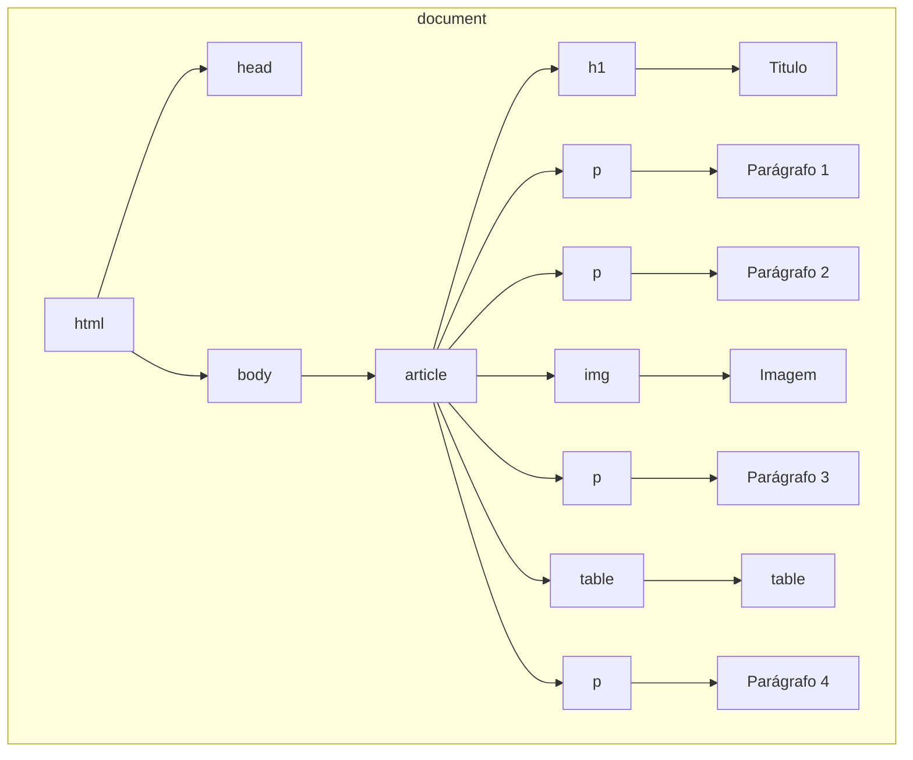
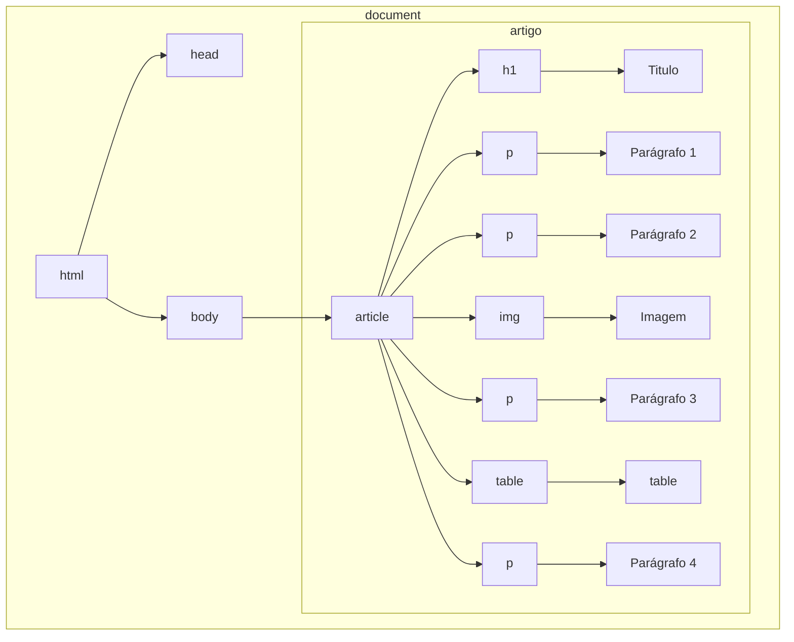
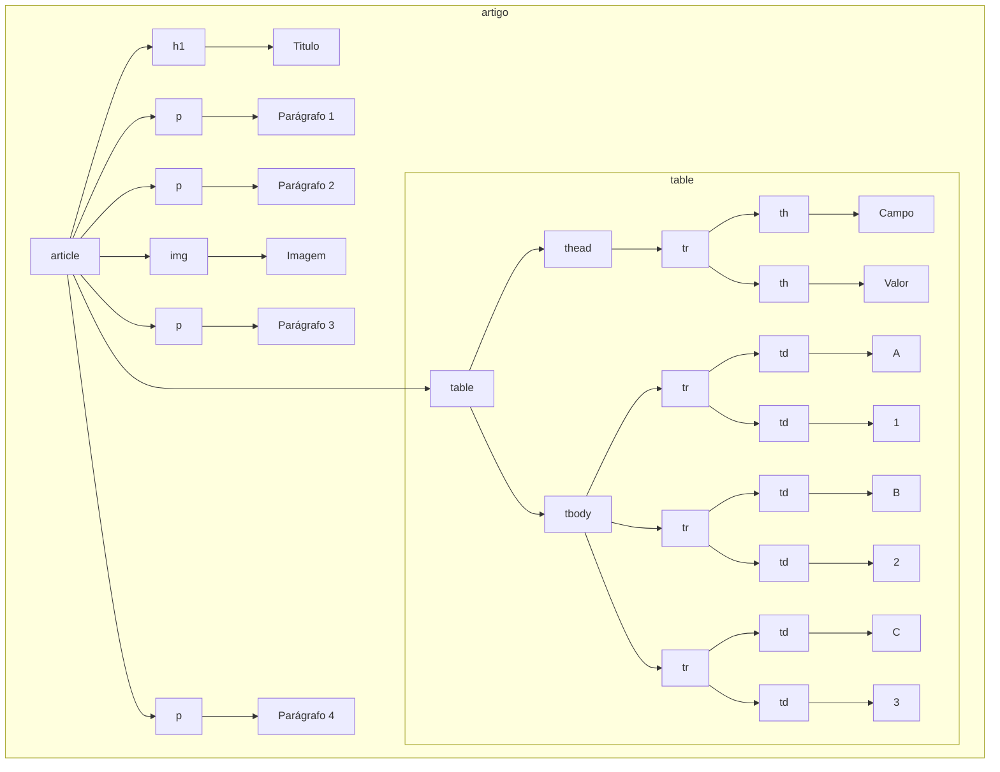

# Acessando elementos do DOM

## Sumário
1. [Acessando o DOM](#acessando-o-dom)
2. [Acessando elementos](#acessando-elementos)
3. [Seletores CSS](#seletores-css)
4. [Subconsultas](#subconsultas)
5. [Percorrendo elementos do DOM](#percorrendo-elementos-do-dom)
6. [Referências](#referências)
## Acessando o DOM
O objeto do DOM é exposto pelo navegador por intermédio da palavra chave `document` e é a partir deste objeto que teremos acesso ao métodos e atributos que compõem o DOM.
## Acessando elementos
Para acessar um elemento ou uma coleção de elementos, o navegador utiliza algum atributo do elemento para identificá-lo na árvore que representa o documento. Para isso, existem alguns métodos:
* `document.getElementById("id-do-elemento")`: retorna o elemento, do tipo , cujo atributo `id` tenha o valor especificado. Por exemplo, `document.getElementById("foo")` retorna o elemento, do tipo [Element](https://developer.mozilla.org/en-US/docs/Web/API/Element), que possua o atributo `id` igual a `foo`.
* `document.getElementsByClassName("classe-do-elemento")`: identifica todos os elementos com a classe especificada e retorna uma coleção de elementos. Por exemplo, `document.getElementsByClassName("bar")` retorna uma coleção, do tipo [HTMLCollection](https://developer.mozilla.org/en-US/docs/Web/API/HTMLCollection), com todos os elementos cujo atributo `class` tenha o valor `bar`.

> [!CAUTION]
> `document.getElementsByClassName` retorna uma coleção viva de elementos, ou seja, essa coleção é atualizada conforme as modificações no DOM.

* `document.getElementsByTagName("tag-do-elemento")`: identifica todos os elementos com a tag especificada e retorna uma coleção de elementos, do tipo [HTMLCollection](https://developer.mozilla.org/en-US/docs/Web/API/HTMLCollection). Por exemplo, `document.getElementsByTagName("p")` retorna uma coleção com todos os elementos que representam um parágrafo (`<p>`) na página.
* `document.querySelector("seletor-css")`: identifica e retorna o primeiro elemento da página, do tipo [Element](https://developer.mozilla.org/en-US/docs/Web/API/Element), que corresponda ao seletor CSS especificado.
* `document.querySelectorAll("seletor-css")`: identifica e retorna uma coleção de elementos da página, do tipo [NodeList](https://developer.mozilla.org/en-US/docs/Web/API/NodeList), que correspondam ao seletor escolhido. 
  
> [!TIP]
> Os tipos listados acima ([Element](https://developer.mozilla.org/en-US/docs/Web/API/Element), [HTMLCollection](https://developer.mozilla.org/en-US/docs/Web/API/HTMLCollection) e  [NodeList](https://developer.mozilla.org/en-US/docs/Web/API/NodeList)) fazem parte da API do DOM e são classes JavaScript e, portanto, implementam seus próprios atributos e métodos. Veremos alguns atributos e métodos ao longo do material, porém as documentações estão linkadas no material para consulta mais aprofundada.
## Seletores CSS
[Seletores CSS](https://developer.mozilla.org/pt-BR/docs/Web/CSS/CSS_selectors) são responsáveis por informar ao navegador a quais elementos da página determinadas regras de estilo devem ser aplicadas. Por exemplo, o seletor CSS que identifica um elemento com id `foo`, é o seletor `#foo`. Da mesma form, para identificar os elementos da classe `bar`, pode-se utilizar o seletor `.bar` e elementos da tag `h1` podem ser identificados pelo seletor `h1`.
Para identificar elementos por qualquer outro valor de atributo pode-se utilizar o seletor `[atributo="valor"]`. Desta forma, para identificar uma caixa de seleção de uma página, pode-se utilizar o seletor `[type="checkbox"]`.
## Subconsultas
Como o DOM é uma árvore, é possível extrair sub-árvores a partir da árvore original, por exemplo, dado o documento HTML abaixo:

```html
<!DOCTYPE html>
<html lang="pt-BR">
<head>
  <meta charset="UTF-8">
  <meta name="viewport" content="width=device-width, initial-scale=1">
  <title>Documento</title>
</head>
<body>
  <article>
    <h1>Documento</h1>
    <p>Lorem, ipsum dolor sit amet consectetur adipisicing elit. Ullam, nihil?</p>
    <p>Lorem, ipsum dolor sit amet consectetur adipisicing elit. Quidem, aliquam tempore voluptas reiciendis rerum
      consectetur. Quia voluptas accusamus harum tempore.</p>
    </img>
    <p>Lorem ipsum dolor sit amet, consectetur adipisicing elit. Quia blanditiis magni dicta?</p>
    <table>
      <thead>
        <tr>
          <th>Campo</th>
          <th>Valor</th>
        </tr>
      </thead>
      <tbody>
        <tr>
          <td>A</td>
          <td>1</td>
        </tr>
        <tr>
          <td>B</td>
          <td>2</td>
        </tr>
        <tr>
          <td>C</td>
          <td>3</td>
        </tr>
      </tbody>
      <p>Lorem ipsum dolor sit amet consectetur adipisicing elit. Iure ad neque officia obcaecati impedit eligendi
        perferendis aliquid laborum placeat pariatur!</p>
    </table>
  </article>
</body>
</html>
```

Podemos simplificar o documento representando-o pela seguinte árvore:



> [!NOTE]
> Em JavaScript, uma variável pode ser declarada utilizando uma das palavras chaves: `var`, `let`, `const`. De modo geral, `const` é utilizada para variáveis constantes, ou seja, que não serão redefinidas ao longo do ciclo de vida do programa, já `let` e `var` podem ser utilizadas para variáveis que poderão ser redefinidas.
> Outra diferença entre os usos é que enquanto `let` e `const` definem variáveis com escopo de bloco, `var` define variáveis com escopo de função ou global.

É possível destacar a sub-árvore que representa o artigo (`<article>`) utilizando:

```javascript
const artigo = document.querySelector("article")
```

ou

```javascript
const artigo = document.getElementsByTagName("article")[0]
```

As duas operações são equivalentes e resultarão no diagrama demonstrado abaixo, note que a raiz da sub-árvore `artigo` passa a ser a tag `article`:



Da mesma forma, partindo da sub-árvore `artigo` é possível extrair uma sub-árvore `tabela` a partir de `artigo` utilizando:

```javascript
const tabela = artigo.querySelector("table")
```

A operação acima resultaria na seguinte sub-árvore:



> [!TIP]
> Também é possível extrair a sub-árvore `tabela` a partir do `document` utilizando `document.querySelector("table")`
## Percorrendo elementos do DOM
//TODO
## Referências
+ [CSS Selectors](https://developer.mozilla.org/en-US/docs/Web/CSS/CSS_selectors)
+ [Resumo: métodos de acesso DOM](https://pt.khanacademy.org/computing/computer-programming/html-css-js/html-js-dom-access/a/summary-dom-access-methods)
+ [Element](https://developer.mozilla.org/en-US/docs/Web/API/Element)
+ [HTMLCollection](https://developer.mozilla.org/en-US/docs/Web/API/HTMLCollection)
+ [NodeList](https://developer.mozilla.org/en-US/docs/Web/API/NodeList)
+ [var, let e const – Qual é a diferença?](https://www.freecodecamp.org/portuguese/news/var-let-e-const-qual-e-a-diferenca/)