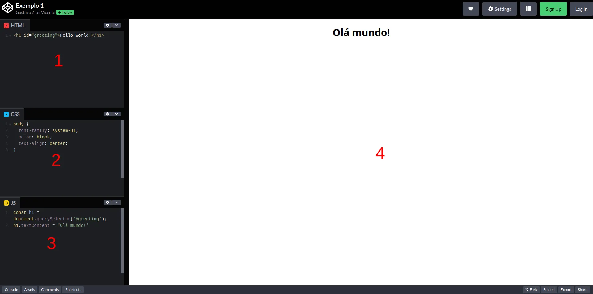

# Manipulando elementos do DOM
## Sumário
1. [Manipulando elementos do DOM](#acessando-elementos-do-dom)
2. [Modificar elementos existentes](#modificar-elementos-existentes)
3. [Referências](#referências)
## Manipulando elementos do DOM
Pode-se definir manipulação do DOM como o processo de interagir e modificar a estrutura de um documento em tempo real, utilizando linguagens de programação. A linguagem mais comum para este propósito é o JavaScript, porém é possível realizar as mesmas ações utilizando outras linguagens utilizando [WebAssembly](https://developer.mozilla.org/pt-BR/docs/WebAssembly).
Este processo é fundamental para a criação de páginas interativas, que sejam capazes de responder a ações do usuário de forma dinâmica, sem que seja necessário carregar uma página completamente nova a cada interação.
A exemplo das definições de estilização da página, que podem ser incluídas no arquivo HTML dentro da tag `style` ou importadas de outro arquivo utilizando uma tag `link`, o código JavaScript pode ser implementado diretamente no HTML, dentro da tag `script` ou importado de outro arquivo utilizando a propriedade `src` da tag script.

> [!TIP]
> Nos nossos exemplos utilizaremos o [Codepen](https://codepen.io/). Lá, será possível observar 4 janelas, conforme a imagem abaixo:
> 
> Na janela 1, é exibido o código HTML do `body` da página, na janela 2 o CSS responsável pela estilização da página (`style.css`) e na janela 3 o código JavaScript que é executado na página (`index.js`). A janela 4 exibe o resultado final da página combinando o conteúdo das demais janelas.
> É como se o conteúdo da página fosse gerado pelo seguinte código:
>
> ```html
> <!DOCTYPE html>
> <html lang="pt-BR">
>     <head>
>         <meta charset="UTF-8">
>         <meta name="viewport" content="width=device-width, initial-scale=1.0">
>         <style>
>           <!-- CSS -->
>         </style>
>     </head>
> 
>     <body>
>         <script>
>           <!-- JS -->
>         </script>
>         <!-- HTML -->
>     </body>
> 
> </html>
> ```
> 
>Que equivale a:
>
> ```html
> <!DOCTYPE html>
> <html lang="pt-BR">
>     <head>
>         <meta charset="UTF-8">
>         <meta name="viewport" content="width=device-width, initial-scale=1.0">
>         <link rel="stylesheet" href="style.css">
>     </head>
> 
>     <body>
>         <script src="index.js"></script>
>         <!-- HTML -->
>     </body>
> 
> </html>
> ```
>
> __Recomendação:__ Para explorar o comportamento da página, você pode apagar o código JavaScript, para ver o ponto de partida a página e depois voltar o código linha a linha para entender como ele interage com o conteúdo.
 
## Modificar elementos existentes
Existem recursos para modificar o conteúdo ou estilo de elementos já existentes no documento. A seguir veremos exemplos de algumas funcionalidades para manipulação do conteúdo do documento.
A partir de um elemento presente no documento, pode-se utilizar o atributo `textContent` para modificar o conteúdo interno do elemento. Por exemplo, temos uma página contendo o seguinte elemento:

```html
<h1 id="greeting">Hello World!</h1>
```

Podemos alterar o texto exibido pelo elemento acima utilizando:

```javascript
const greeting = document.querySelector("#greeting");
// a operação acima é equivalente a document.getElementById("greeting")

greeting.textContent = "Olá mundo!"
```

Dessa forma, o documento passará a conter o seguinte elemento:

```html
<h1 id="greeting">Olá mundo!</h1>
```

O [exemplo 1](https://codepen.io/gzitei/pen/abeyWoj) demonstra o comportamento ilustrado acima.
Outra possibilidade é alterar o estilo aplicado a um determinado elemento, utilizando os atributos `style` e `className`. Em nosso [exemplo 2](https://codepen.io/gzitei/pen/mdNMmYR) iniciamos nossa página com um quadrado vermelho e um círculo azul, definidos conforme apresentado pelo código HTML:

```html
<div class="square red"></div>
<div class="circle blue"></div>
```

E CSS:

```css
.square {
  width: 100px;
  height: 100px;
}

.circle {
  width: 100px;
  height: 100px;
  border-radius: 100%;
}

.red {
  background-color: red;
}

.blue {
  background-color: blue;
}
```

Utilizando a propriedade `style` modificamos o `backgroud-color` do círculo, para que que ele passe a ser verde:

```javascript
const circle = document.querySelector(".circle");
circle.style.backgroundColor = "green";
```

Alteramos o estilo do quadrado utilizando a propriedade `className` para deixá-lo roxo:

```javascript
const square = document.querySelector(".square");
square.className = "square purple"
```

> [!IMPORTANT]
> JavaScript não oferece suporte ao uso de `kebab-case`, por isso `background-color` é usado em sua versão `camelCase`: `backgroundColor`.
> Além disso, `class` é uma palavra reservada em JavaScript, por isso para alterar o atributo `class` de um elemento, é necessário modificar a propriedade `className`. 

Além disso, é possível também remover elementos da página, utilizando o método `remove`. No [exemplo 3](https://codepen.io/gzitei/pen/RwXZgwK) por exemplo, temos uma tabela que é removida utilizando:

```javascript
const table = document.querySelector("table");
table.remove();
```

Vale observar que o `table.remove()` remove toda a sub-árvore a partir do elemento `<table>`. Existe a possibilidade também de ocultar o elemento do documento, utilizando:

```javascript
const table = document.querySelector("table");
table.style.display = "none";
```

O DOM também oferece recursos para a criação e inserção de novos elementos em uma página. O método `createElement` permite a criação de novos elementos. No exemplo abaixo, criamos um elemento `<p>` e um elemento ``:

```javascript
const firstParagraph = document.createElement("p");
firstParagraph.textContent = "A tabela abaixo apresenta alguns modelos de carros fabricados na década de 1990:";

const img = document.createElement("img");
img.setAttribute("src", "https://ateliedocarro.com.br/wp-content/uploads/2022/08/Escort-1.8I-GL-1994-site-1.jpg");
img.width = 400;
```

No entanto, a simples criação de elementos não os torna visíveis na página, para isso é necessários que os novos elementos sejam inseridos na árvore do documento. Para isso, o DOM disponibiliza outros métodos:
+ `appendChild`: Este método permite anexar um novo elemento `child` ao elemento indicado. Por exemplo, o código abaixo utiliza os métodos `createElement` e `appendChild` para criar os cabeçalhos de uma tabela:

```javascript
const table = document.createElement("table");
const thead = document.createElement("thead");
const headers = document.createElement("tr");
thead.appendChild(headers);
table.appendChild(thead);

const columns = ["Marca", "Modelo", "Fabricação"];
for (let i = 0; i < columns.length; i++) {
  let th = document.createElement("th");
  th.textContent = columns[i];
  headers.appendChild(th);
}
```
> [!TIP]
> Em JavaScript, podemos iterar por um `array` utilizando o `for` com uma sintaxe muito parecida com a sintaxe do laço `for` em C. O critério de parada para o laço `for` é `columns.length`, que é uma propriedade de `arrays` em JavaScript que representa o número de elementos contidos no `array`.

+ `insertBefore`: Para oferecer mais controle ao inserir novos elementos no DOM, é possível especificar ao elemento `parent` onde antes de qual `sibling` o novo elemento deve ser inserido. No exemplo abaixo, inserimos uma tabela no elemento `content` e logo em seguida, estamos criando um parágrafo, que precisa ser inserido antes da tabela para que o conteúdo faça sentido:

```javascript
const content = document.querySelector("#content");

content.appendChild(table);

const firstParagraph = document.createElement("p");
firstParagraph.textContent = "A tabela abaixo apresenta alguns modelos de carros fabricados na década de 1990:";

content.insertBefore(firstParagraph, table);
```

`append`: Permite a criação de um elemento `sibling`, ou seja, no mesmo nível de hierarquia do elemento especificado. No exemplo a seguir, estamos criando uma imagem no mesmo nível de hierarquia do elemento `content`:

```javascript
const img = document.createElement("img");
img.setAttribute("src", "https://ateliedocarro.com.br/wp-content/uploads/2022/08/Escort-1.8I-GL-1994-site-1.jpg");
img.width = 400;

content.append(img);
```

Os exemplos acima, bem como o resultado final obtido, podem ser observados em nosso [exemplo 4](https://codepen.io/gzitei/pen/BaXdZdV).

> [!IMPORTANT]
> O exemplo 4 apresenta o uso de algumas funcionalidades do JavaScript, que serão explicadas a seguir:
> 
>  + [__Declaração de função__](https://www.w3schools.com/js/js_functions.asp)
> 	 + `function` em JavaScript o modo mais explícito de se declarar uma função é usando a palavra chave `function`.
> 		
> 		```javascript
> 		function createCarRow(obj) {
> 			const tr = document.createElement("tr");
> 			for ([key, value] of Object.entries(obj)) {
> 				let td = document.createElement("td");
> 				td.textContent = value;
> 				tr.appendChild(td);
> 			}
> 			return tr;
> 		}
> 		```
> 	
> 	 + `arrow function`, uma função pode ser declarada de modo anônimo utilizando a notação chamada `arrow function`, que consiste da seguinte estrutura:
> 		 ```javascript
> 		 (a, b) => { return a + b }
>		  ```
>		  No exemplo acima, a função recebe os argumentos `a` e `b` e retorna o resultado de `a + b`.
>		
>		  As `arrow functions` podem aparecer ainda com outras configurações, por exemplo:
>		
> 		  ```javascript
> 		  a => { return a + 4 } // quando a arrow function recebe apenas um argumento, pode-se dispensar os parênteses
> 		
> 		  _ => { return true } // quando a arrow function não recebe argumentos, pode-se utilizar o underline
> 		
> 		  () => { return 5 } // equivale ao uso do underline
>		  ```
>		  As `arrow functions` podem ser atribuídas a variáveis, bastando executar a variável para obter o resultado da função.
>		
>		  ```javascript
>		  const soma = (a, b) => { return a + b };
>		  soma(3, 2) // retorna 5
>		  ```
>		
> + [__Métodos de Arrays__](https://www.w3schools.com/jsref/jsref_obj_array.asp)
> 	+ `forEach`: é um método que permite percorrer todos os elementos de um array, muito similar ao laço `for`, aplicando uma função a cada elemento. No exemplo a seguir, o 
> 	
> 		```javascript
> 		tableRows.forEach((tr) => { tbody.appendChild(tr); });
> 		```
> 		
> 	+ `map`: similar ao `forEach`, percorre todos os elementos do array aplicando uma função a cada elemento e armazenando o seu resultado na posição do elemento. Por exemplo:
> 	
> 		```javascript
> 		const squared = x => { return x * x }
> 		const arr = [1, 2, 3];
> 		const arrSq = arr.map(squared);
> 		console.log(arrSq) // [1, 4, 9]
> 		```
>

## Referências
+ [WebAssembly | MDN](https://developer.mozilla.org/pt-BR/docs/WebAssembly)
+ [JavaScript e CSS - Aprendendo desenvolvimento web | MDN](https://developer.mozilla.org/pt-BR/docs/Learn/JavaScript/Client-side_web_APIs/Manipulating_documents)
+ [Node.textContent](https://developer.mozilla.org/pt-BR/docs/Web/API/Node/textContent)
+ [HTMLElement: style](https://developer.mozilla.org/en-US/docs/Web/API/HTMLElement/style)
+ [Element: className](https://developer.mozilla.org/en-US/docs/Web/API/Element/className)
+ [Element: remove](https://developer.mozilla.org/en-US/docs/Web/API/Element/remove)
+ [display: CSS](https://developer.mozilla.org/en-US/docs/Web/CSS/display)
+ [Node: insertBefore](https://developer.mozilla.org/pt-BR/docs/Web/API/Node/insertBefore)
+ [Node.appendChild](https://developer.mozilla.org/pt-BR/docs/Web/API/Node/appendChild)
+ [Element: append](https://developer.mozilla.org/en-US/docs/Web/API/Element/append)
