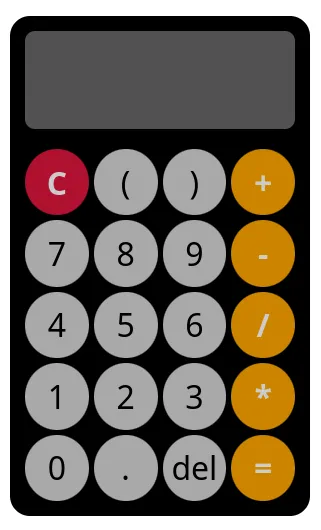

# Projeto - Calculadora
## Proposta
Chegou a hora de colocar a mão na massa e empregar os conhecimento obtidos em HTML, CSS e JavaScript para elaborar um projeto.
A proposta é que seja construída uma calculadora. A seguir, temos uma __sugestão__ de design para a calculadora:

## Prévia
Você pode consultar a prévia da calculadora [aqui](https://htmlpreview.github.io/?https://raw.githubusercontent.com/gzitei/web-fatec/refs/heads/main/05.%20Projeto/projeto/index.html) e pode consultar o código fonte da minha solução [aqui](https://github.com/gzitei/web-fatec/tree/main/05.%20Projeto/projeto). 

> [!ATTENTION]
> 1. __Crie a SUA solução:__ Não existe um gabarito! O importante é que sua calculadora funcione utilizando os conhecimentos desenvolvidos até aqui.
> 2. __Acostume-se com documentação__: Você pode (e deve) pesquisar nas documentações apresentadas ao longo do material qualquer funcionalidade que tenha deixado dúvida.
> 3. __Pergunte:__ Caso haja alguma dúvida, fique a vontade para abrir uma [nova issue](https://github.com/gzitei/web-fatec/issues/new) no repositório. Sua dúvida pode ser a dúvida dos demais colegas!