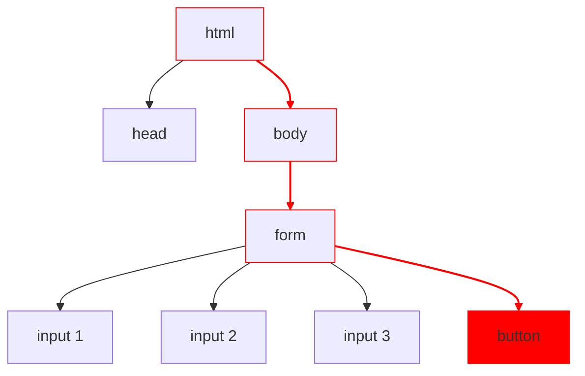

# Eventos do DOM
## Sumário
1. [Definição](#definição)
2. [_Event Listeners_ e _Event Handlers_](#event-listeners-e-event-handlers)
2. [_Event Capturing_ e _Event Bubbling_](#event-capturing-e-event-bubbling)
3. [Referências](#referências)
## Definição
Eventos são ações ou ocorrências que acontecem dentro do navegador. Estes eventos podem disparar gatilhos associados a estas ações e aos elementos onde eles ocorrem. Nós, desenvolvedores, podermos registrar ouvintes de eventos (_event listeners_) e associá-los a manipuladores de eventos (_event handlers_), para oferecer mais interatividade para o usuário em nossas páginas.
Existem diversos tipos de eventos, que podem estar associados a:
+ Uma ação do usuário na página: um clique do mouse, uma tecla pressionada ou até mesmo um movimento do mouse.
+ Uma ocorrência da página: o término do carregamento do conteúdo, um envio de formulário, um erro.
+ Um conteúdo da página: um vídeo sendo reproduzido ou finalizando sua execução e até mesmo interrompido.
Outros tipos de eventos podem ser consultados [aqui](https://www.w3schools.com/jsref/dom_obj_event.asp).
## _Event Listeners_ e _Event Handlers_
Um _event listener_ é um mecanismo que identifica quando um evento específico ocorre e inicia uma função, _event handler_, associada para tratar o evento.
É possível definir _event listeners_ em uma tag html, como no [exemplo](https://codepen.io/gzitei/pen/eYqEaoQ) a seguir:

```html
<script>
	function eventHandler() {
	  alert('A função event handler foi executada!');
	}
</script>
<button onclick="eventHandler()"> Clique aqui! </button>
```

Outra forma, e mais comum, de uso de _event listeners_ é definir um _event listener_ usando JavaScript. O [exemplo](https://codepen.io/gzitei/pen/oNKerzx) a seguir é equivalente ao exemplo anterior, porém utiliza o método `addEventListener`, que recebe como argumentos um string, que representa o evento, e uma função de `callback`, o _event handler_.

```html
<script>
	function eventHandler() {
	  alert('A função event handler foi executada!');
	}
	const button = document.querySelector("button");
	button.addEventListener("click", eventHandler);
</script>
<button> Clique aqui! </button>
```

Existem formas alternativas para o exemplo acima, que são mais comuns de encontrar, utilizando o conceito de `arrow functions`:

```javascript
<script>
	const eventHandler = () => alert('A função event handler foi executada!');
	const button = document.querySelector("button");
	button.addEventListener("click", eventHandler);
</script>
<button> Clique aqui! </button>
```

ou ainda, utilizando `funções anônimas`, ou seja, funções não nomeadas:

```javascript
<script>
	const button = document.querySelector("button");
	button.addEventListener("click", () => {
		alert('A função event handler foi executada!');
	});
</script>
<button> Clique aqui! </button>
```
## _Event Capturing_ e _Event Bubbling_
Elementos do documento podem alocados dentro de outros elementos. Elementos contidos dentro de outros elementos são chamados elementos aninhados, ou em inglês, _nested elements_.
Por estarem aninhados, não é difícil imaginar que quando um evento ocorre em um elemento, este evento se propaga por todos os elementos que o contenham. Pensando na árvore que representa o documento, um evento que ocorre um de seus nós vai se propagar por todo o seu ramo, até a raiz. A este efeito se dá o nome de _event bubbling_.
Este evento pode ser capturado (_event capture_) e tratado, por qualquer elemento no ramo, basta adicionar um _event listener_ no elemento onde se deseja tratar o evento.
Para ilustrar, podemos imaginar que na árvore abaixo, o usuário clicou no botão contido no formulário. O evento `click` vai se propagar (borbulhar) ao longo de todo o ramo destacado em vermelho, até a raiz do documento:



Por este motivo, é possível adicionar um _event listener_ em qualquer elemento contido no ramo para capturar o evento disparado a partir do clique no botão. É possível identificar o elemento alvo do evento a partir da propriedade `target` do evento gerado:

```javascript
const form = document.querySelector("form");
form.addEventListener("click", (event) => {
	const target = event.target;
	if (target.tagName == "button") {
		event.preventDefault(); // impede o comportamento padrão do formulário, que é realizar uma requisição http
		const formData = new FormData(form);
		// process form data
	}
});
```

No exemplo acima, quando o _event handler_ detecta que o evento foi disparado pelo clique em um botão, ele utiliza o método `preventDefault` do objeto evento para evitar que seja realizada uma requisição http para em seguida iniciar o tratamento dos dados do formulário. Só é possível interceptar o evento disparado pelo botão no elemento `form`, graças ao _event bubbling_.
Este conceito é muito útil para evitar que se sobrecarregue uma página com diversos elementos ouvindo por eventos. É possível evitar que um evento continue se propagando por um ramo por meio do método `stopPropagation`.
No exemplo anterior, para evitar que o evento continuasse se propagando para além do `body` da página, poderíamos utilizar a seguinte estratégia:

```javascript
const body = document.querySelector("body");
body.addEventListener("click", e => e.stopPropagation());
```

## Referências
+ [Introdução aos eventos](https://developer.mozilla.org/pt-BR/docs/Learn/JavaScript/Building_blocks/Events)
+ [HTML DOM Event Object](https://www.w3schools.com/jsref/dom_obj_event.asp)
+ [Creating and triggering events](https://developer.mozilla.org/en-US/docs/Web/Events/Creating_and_triggering_events)
+ [Event Bubbling](https://developer.mozilla.org/en-US/docs/Learn/JavaScript/Building_blocks/Event_bubbling)
+ [Event Bubbling and Event Capturing in JavaScript – Explained with Examples](https://www.freecodecamp.org/news/event-bubbling-and-event-capturing-in-javascript/)